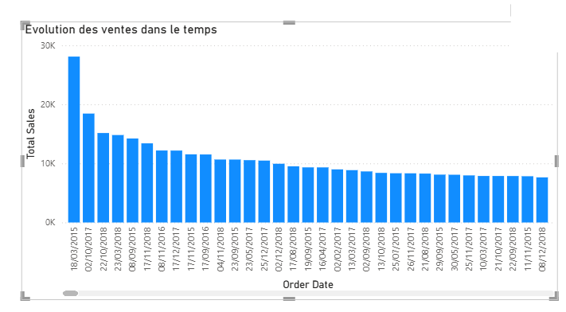
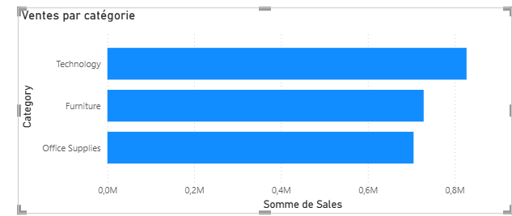
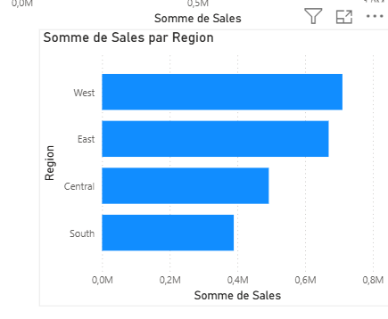
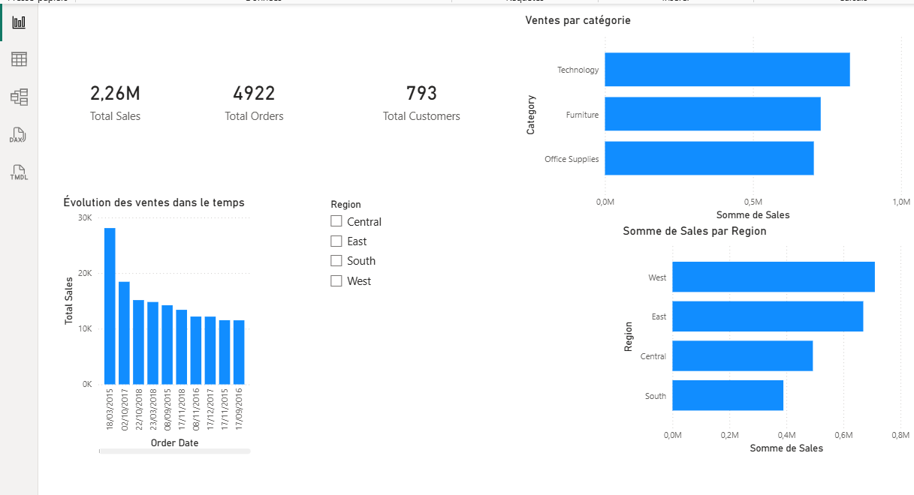

#  Analyse des ventes e-commerce avec Power BI

##  Contexte

Dans un contexte de forte concurrence, une entreprise e-commerce souhaite analyser ses performances commerciales afin de mieux comprendre ses ventes et identifier des axes d'amélioration.

##  Objectifs

* Analyser le chiffre d’affaires global
* Identifier les catégories de produits les plus performantes
* Étudier les performances par région
* Analyser l’évolution des ventes dans le temps

##  Données

Les données utilisées proviennent d’un dataset e-commerce contenant des informations sur :

* les commandes
* les clients
* les produits
* les ventes

##  Outils utilisés

* Power BI
* Power Query
* DAX

##  Analyse

* La catégorie **Technology** génère le plus de chiffre d’affaires
* La catégorie **Office Supplies** est la moins performante
* La région **West** est la plus performante
* La région **South** présente les performances les plus faibles
* Les ventes évoluent dans le temps avec des variations notables

##  Visualisations

### 📈 Évolution des ventes

Les ventes évoluent dans le temps avec des variations, montrant des périodes de hausse et de baisse.

### 📊 Ventes par catégorie

La catégorie Technology génère le plus de chiffre d’affaires, tandis que la catégorie Office Supplies présente la performance la plus faible.

### 🌍 Ventes par région

La région West est la plus performante, tandis que la région South présente le chiffre d’affaires le plus faible.

### 🎛️ Dashboard

Le dashboard permet une analyse globale des performances commerciales grâce à des indicateurs clés et des filtres interactifs.

##  Recommandations

* Renforcer les investissements sur les produits technologiques
* Analyser les causes de la faible performance de certaines catégories
* Mettre en place des actions ciblées pour améliorer les ventes dans la région South

##  Fichiers

* `sales_analysis.pbix` → dashboard Power BI
* `ecommerce_data.csv` → dataset utilisé
